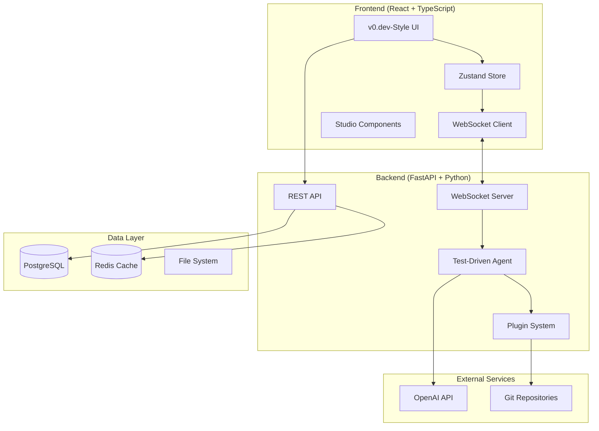
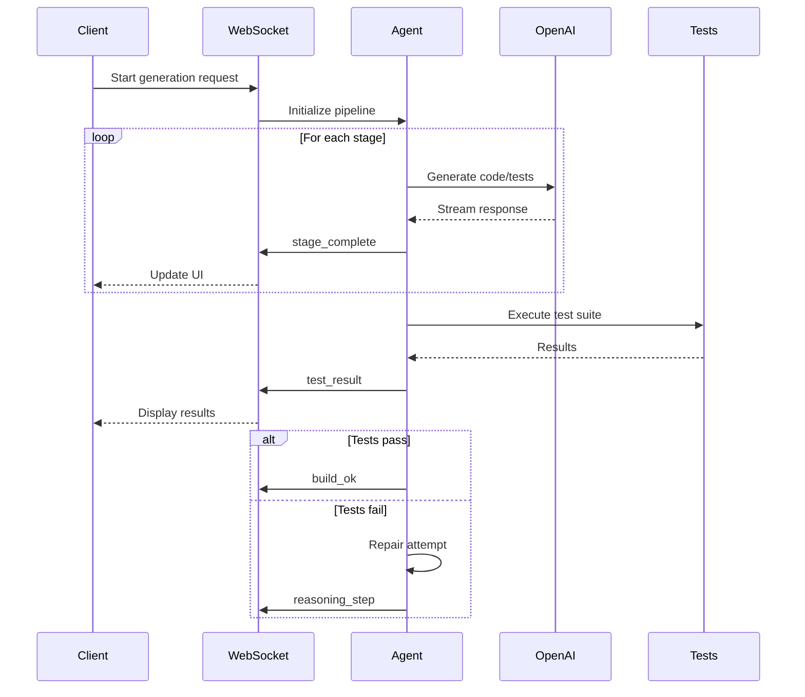

# AI Studio Architecture Documentation

## Overview

This document provides a comprehensive overview of the AI Studio architecture, designed to rival v0.dev in sophistication while maintaining extensibility and performance.

## System Architecture

### High-Level Architecture



## Frontend Architecture

### Component Hierarchy

```
App (Router)
├── StudioLayout
│   ├── StudioTopBar
│   │   ├── ProjectSelector
│   │   ├── UserDropdown
│   │   └── ConnectionStatus
│   ├── WorkspaceTabs
│   │   ├── TubelightNavBar (Workspace)
│   │   ├── TubelightNavBar (View)
│   │   └── VersionSelector
│   └── WorkspaceContent
│       ├── ChatPanel (activeWorkspace=chat)
│       ├── DesignPanel (activeWorkspace=design)
│       ├── PreviewPanel (activeView=preview)
│       └── CodeEditor (activeView=code)
```

### State Management Architecture

The application uses Zustand for global state management with the following structure:

```typescript
interface StudioStore {
  // Core State
  state: StudioState
  currentProject: string | null
  
  // Workspace State (v0.dev style)
  activeWorkspace: 'chat' | 'design'
  activeView: 'preview' | 'code'
  
  // Generation State
  isGenerating: boolean
  currentStage: AgentStage | null
  buildProgress: number
  
  // File Management
  files: Record<string, FileNode>
  currentFileId: string | null
  fileTree: string[]
  
  // Real-time Features
  connectionStatus: 'connected' | 'connecting' | 'disconnected'
  testResults: TestResult[]
  reasoningSteps: ReasoningStep[]
  
  // Plugin System
  availablePlugins: PluginTool[]
  selectedPlugins: string[]
}
```

### WebSocket Integration

Real-time communication uses an enhanced WebSocket system with 8 message types:

1. **token** - Streaming code generation
2. **file_closed** - File completion with animations
3. **build_progress** - Compilation progress updates
4. **build_ok/error** - Build status notifications
5. **stage_complete** - Pipeline stage completion
6. **test_result** - Live test execution results
7. **reasoning_step** - AI decision explanations
8. **hot_reload** - Prop inspector updates

### Design System

The design system follows a 4px spacing scale with semantic color tokens:

```css
:root {
  /* Spacing Scale */
  --space-tight: 0.25rem;     /* 4px */
  --space-standard: 0.5rem;   /* 8px */
  --space-comfortable: 1rem;  /* 16px */
  --space-spacious: 1.5rem;   /* 24px */
  --space-generous: 2rem;     /* 32px */
  
  /* Semantic Colors */
  --color-studio: 221.2 83.2% 53.3%;
  --color-success: 142.1 76.2% 36.3%;
  --color-warning: 32.9 94.6% 43.7%;
  --color-error: 0 84.2% 60.2%;
}
```

## Backend Architecture

### API Layer Structure

```
app/
├── api/
│   ├── deps.py              # Dependency injection
│   ├── main.py              # API router setup
│   └── routes/
│       ├── studio.py        # Studio WebSocket endpoints
│       ├── users.py         # User management
│       └── items.py         # Legacy CRUD operations
├── core/
│   ├── config.py            # Configuration management
│   ├── db.py                # Database connection
│   └── security.py          # Authentication & security
├── services/
│   ├── test_driven_agent.py # 6-stage ReAct pipeline
│   ├── plugin_system.py     # Extensible tool layer
│   └── openai_service.py    # OpenAI API integration
├── models.py                # Database models
└── crud.py                  # Database operations
```

### Test-Driven Agent Pipeline

The core AI system implements a 6-stage ReAct pipeline:

```python
class AgentStage(str, Enum):
    INTERPRET = "interpret"    # Convert prompt to formal contract
    SCAFFOLD = "scaffold"      # Generate minimal compilable files
    UNIT_TEST = "unit_test"    # Create comprehensive test specs
    EXECUTE = "execute"        # Run tests in isolated environment
    REPAIR = "repair"          # Fix failing code (max 2 attempts)
    REPORT = "report"          # Stream final results
```

Each stage has specific responsibilities:

1. **Interpret**: Converts natural language to structured requirements
2. **Scaffold**: Creates minimal file structure with TODO comments
3. **Unit-Test**: Generates Vitest/Testing Library specifications
4. **Execute**: Runs tests in isolated Node.js environment
5. **Repair**: Fixes failing tests using error analysis
6. **Report**: Streams completion status and metrics

### Plugin System Architecture

The plugin system provides extensible tool integration:

```python
class PluginManifest(SQLModel, table=True):
    name: str
    version: str
    inputs: List[str]          # Required input file types
    outputs: List[str]         # Generated output types
    command: str               # Execution command
    cost_estimate: float       # Resource usage estimate
    compatibility: List[str]   # Compatible environments
```

Built-in plugins include:
- **Prettier**: Code formatting
- **ESLint**: Linting and code quality
- **Tailwind JIT**: CSS compilation
- **TypeScript**: Type checking

### Database Schema

Enhanced database models support the complete development workflow:

```sql
-- Core project tracking
CREATE TABLE testrun (
    id UUID PRIMARY KEY,
    contract JSONB,           -- Formal requirements
    scaffold_files JSONB,    -- Generated file structure
    test_files JSONB,        -- Test specifications
    test_results JSONB,      -- Execution results
    repair_attempts INT,     -- Number of repair cycles
    success BOOLEAN,         -- Final success status
    created_at TIMESTAMP
);

-- Plugin management
CREATE TABLE pluginmanifest (
    name VARCHAR PRIMARY KEY,
    version VARCHAR,
    inputs JSONB,
    outputs JSONB,
    command VARCHAR,
    cost_estimate FLOAT
);

-- Analytics and observability
CREATE TABLE studioobservation (
    id UUID PRIMARY KEY,
    prompt_hash VARCHAR,      -- Deduplicated prompt tracking
    diff_patch TEXT,         -- Generated code changes
    test_metrics JSONB,      -- Test execution data
    latency_ms INT,          -- Response time
    created_at TIMESTAMP
);
```

## Real-Time Communication

### WebSocket Message Flow



### Rate Limiting & Security

- **JWT Authentication**: WebSocket connections require valid tokens
- **Rate Limiting**: 60 prompts/hour per user with Redis backend
- **Input Sanitization**: All user inputs are validated and sanitized
- **Error Sanitization**: Client errors are sanitized to prevent information leakage

## Performance Optimizations

### Frontend Optimizations

1. **Code Splitting**: Route-based lazy loading
2. **State Optimization**: Zustand subscriptions with selectors
3. **Animation Performance**: Framer Motion with reduced motion support
4. **Bundle Analysis**: Webpack bundle analyzer integration

### Backend Optimizations

1. **Connection Pooling**: PostgreSQL connection pooling with SQLAlchemy
2. **Caching Strategy**: Redis caching for frequently accessed data
3. **Async Processing**: FastAPI async/await throughout
4. **Resource Management**: Memory-efficient file handling

### WebSocket Optimizations

1. **Message Batching**: Combine multiple updates into single messages
2. **Compression**: WebSocket message compression
3. **Reconnection Strategy**: Exponential backoff with circuit breaker
4. **Heartbeat Monitoring**: Connection health checking

## Security Architecture

### Authentication & Authorization

```python
# JWT-based authentication
async def get_current_user(token: str = Depends(oauth2_scheme)):
    credentials_exception = HTTPException(
        status_code=status.HTTP_401_UNAUTHORIZED,
        detail="Could not validate credentials",
        headers={"WWW-Authenticate": "Bearer"},
    )
    try:
        payload = jwt.decode(token, SECRET_KEY, algorithms=[ALGORITHM])
        username: str = payload.get("sub")
        if username is None:
            raise credentials_exception
    except JWTError:
        raise credentials_exception
    
    user = get_user(db, username=username)
    if user is None:
        raise credentials_exception
    return user
```

### Data Protection

1. **Environment Isolation**: Separate .env files for different environments
2. **Secret Management**: Secure handling of API keys and tokens
3. **Input Validation**: Pydantic models for all API inputs
4. **SQL Injection Prevention**: SQLModel/SQLAlchemy parameterized queries

## Monitoring & Observability

### Built-in Analytics

The system includes comprehensive analytics:

```python
class StudioObservation(SQLModel, table=True):
    prompt_hash: str          # Deduplicated prompt tracking
    diff_patch: str          # Generated code changes
    test_metrics: dict       # Test execution metrics
    latency_ms: int          # End-to-end response time
    user_satisfaction: Optional[float]  # User feedback
```

### Health Monitoring

1. **WebSocket Health**: Connection status and message throughput
2. **Database Health**: Connection pool status and query performance
3. **External APIs**: OpenAI API response times and error rates
4. **Resource Usage**: Memory, CPU, and disk utilization

## Deployment Architecture

### Container Strategy

```yaml
# docker-compose.yml structure
services:
  frontend:
    build: ./frontend
    ports: ["5173:5173"]
    environment:
      - VITE_API_URL=http://localhost:8000
      
  backend:
    build: ./backend
    ports: ["8000:8000"]
    environment:
      - DATABASE_URL=postgresql://...
      - OPENAI_API_KEY=${OPENAI_API_KEY}
      
  postgres:
    image: postgres:15
    environment:
      - POSTGRES_DB=studio
      
  redis:
    image: redis:7-alpine
```

### Production Considerations

1. **Load Balancing**: Multiple backend instances behind load balancer
2. **Database Scaling**: Read replicas for analytics queries
3. **CDN Integration**: Static asset delivery via CDN
4. **Monitoring Stack**: Prometheus + Grafana for metrics

## Future Architecture Considerations

### Scalability Enhancements

1. **Microservices**: Split agent pipeline into separate services
2. **Event Sourcing**: Complete audit trail of all changes
3. **CQRS**: Separate read/write models for better performance
4. **Message Queues**: Async processing with Redis/RabbitMQ

### AI/ML Enhancements

1. **Model Fine-tuning**: Custom models trained on user patterns
2. **Embedding Search**: Vector database for code similarity
3. **Predictive Analytics**: ML models for effort estimation
4. **Automated Testing**: AI-generated integration tests

This architecture provides a solid foundation for building a world-class AI development platform that can scale to support thousands of concurrent users while maintaining high performance and reliability. 